# Домашнее задание "Работа с уровнями изоляции транзакции в PostgreSQL"

### Цель:
- научиться работать с ЯО;\
- научиться управлять уровнем изолции транзации в PostgreSQL;

1. Создать новый проект в Яндекс облако или на любых ВМ, например postgres2024-<yyyymmdd>, где
yyyymmdd год, месяц и день вашего рождения (имя проекта должно быть уникально)
2. Создать инстанс виртуальной машины с дефолтными параметрами - 1-2 ядра, 2-4Гб памяти, любой
линукс (на курсе Ubuntu 100%)

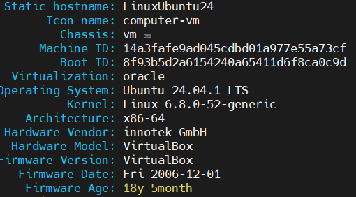

4. Добавить свой ssh ключ

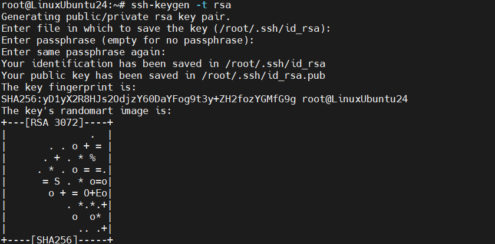

5. Зайти удаленным ssh (первая сессия)

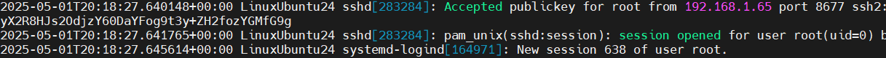

6. Поставить PostgreSQL из пакетов apt install

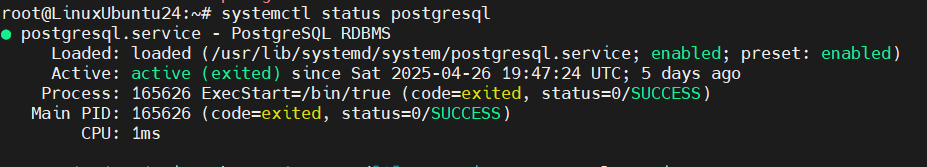

7. Зайти вторым ssh (вторая сессия)

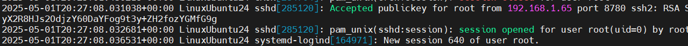

8. Запустить везде psql из под пользователя postgres
9. Выключить auto commit
10. Сделать в первой сессии новую таблицу и наполнить ее данными

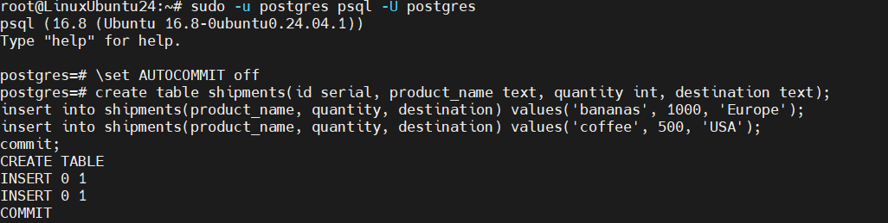

11. Посмотреть текущий уровень изоляции: show transaction isolation level
12. Начать новую транзакцию в обоих сессиях с дефолтным (не меняя) уровнем изоляции
13. В первой сессии добавить новую запись

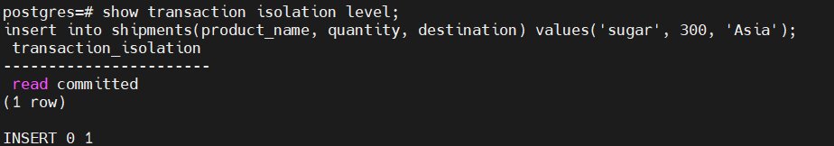

14. Посмотреть таблицу во второй сессии. Видите ли вы новую запись и если да то почему?

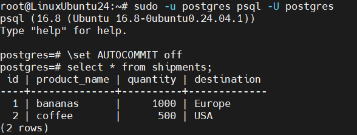

**Не видим потому что мы не должны видеть грязные данные из другой транзакции**

15. Завершить первую транзакцию
16. Посмотреть таблицу во второй сессии. Видите ли вы новую запись и если да то почему?
Завершить транзакцию во второй сессии.

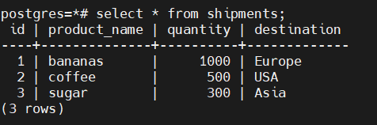

**строка видна потому что мы сделали commit в первой сессии**

18. Начать новые транзакции с repeatable read
19. В первой сессии добавить новую запись

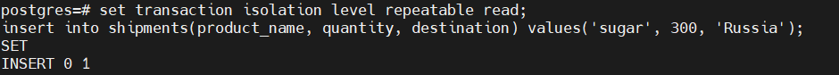

20. Посмотреть таблицу во второй сессии. Видите ли вы новую запись и если да то почему?

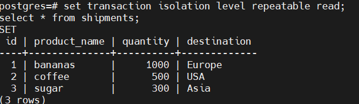

**Новую запись не видим потому что Repeatable Read не позволяет грязное чтение**

21. Завершить первую транзакцию
22. Посмотреть таблицу во второй сессии. Видите ли вы новую запись и если да то почему?
Завершить транзакцию во второй сессии.

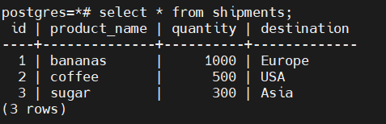

**Новую запись не видим потому что Repeatable Read защищает от аномалии Non-repeatable Reads**
