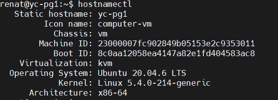
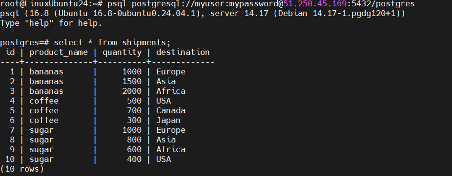

# Домашнее задание "Установка и настройка PostgteSQL в контейнере Docker"

### Цель:
- развернуть ВМ ЯО/Аналоги;\
- установить Docker;\
- установить PostgreSQL в Docker контейнере;\
- настроить контейнер для внешнего подключе

1. Создайте инстанс с Ubuntu 20.04 в Яндекс.Облаке или аналогах.

2. Установите Docker Engine.

3. Создайте каталог /var/lib/postgres для хранения данных.

4. Разверните контейнер с PostgreSQL 14, смонтировав в него /var/lib/postgres.

5. Разверните контейнер с клиентом PostgreSQL.
6. Подключитесь из контейнера с клиентом к контейнеру с сервером и создайте таблицу с данными о перевозках.

7. Подключитесь к контейнеру с сервером с ноутбука или компьютера.

8. Удалите контейнер с сервером и создайте его заново.

9. Проверьте, что данные остались на месте.
