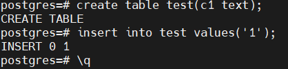

# Домашнее задание "Настройка дисков для Постгреса"

### Цель:
- создавать дополнительный диск для уже существующей виртуальной машины, размечать его и делать на нем файловую систему
- переносить содержимое базы данных PostgreSQL на дополнительный диск
- переносить содержимое БД PostgreSQL между виртуальными машинами

* создайте виртуальную машину c Ubuntu 20.04 LTS (bionic) в GCE типа e2-medium в default VPC в любом регионе и зоне, например us-central1-a или ЯО/VirtualBox

  

* поставьте на нее PostgreSQL 15 через sudo apt
    

* проверьте что кластер запущен через sudo -u postgres pg_lsclusters

    

* зайдите из под пользователя postgres в psql и сделайте произвольную таблицу с произвольным содержимым
  postgres=# create table test(c1 text);
  postgres=# insert into test values('1');
  \q

	
  
* остановите postgres например через sudo -u postgres pg_ctlcluster 15 main stop
    

* создайте новый standard persistent диск GKE через Compute Engine -> Disks в том же регионе и зоне что GCE инстанс размером например 10GB - или аналог в другом облаке/виртуализации

	

* добавьте свеже-созданный диск к виртуальной машине - надо зайти в режим ее редактирования и дальше выбрать пункт attach existing disk
    
  
* проинициализируйте диск согласно инструкции и подмонтировать файловую систему, только не забывайте менять имя диска на актуальное, в вашем случае это скорее всего будет /dev/sdb - [https://www.digitalocean.com/community/tutorials/how-to-partition-and-format-storage-devices-in-linux](https://www.digitalocean.com/community/tutorials/how-to-partition-and-format-storage-devices-in-linux "https://www.digitalocean.com/community/tutorials/how-to-partition-and-format-storage-devices-in-linux")

	
    
    
    
* перезагрузите инстанс и убедитесь, что диск остается примонтированным (если не так смотрим в сторону fstab)
    

* сделайте пользователя postgres владельцем /mnt/data - chown -R postgres:postgres /mnt/data/
* перенесите содержимое /var/lib/postgresql/15 в /mnt/data - mv /var/lib/postgresql/15 /mnt/data
* попытайтесь запустить кластер - sudo -u postgres pg_ctlcluster 15 main start
* напишите получилось или нет и почему
    
**не получилось тк директорию переместили**

  
* задание: найти конфигурационный параметр в файлах раположенных в /etc/postgresql/14/main который надо поменять и поменяйте его

    

  
* напишите что и почему поменяли
**поменял параметр data_directory = '/mnt/data/15/main' в файле /etc/postgresql/15/main/postgresql.conf тк в нем указывается путь к данным**

  
* попытайтесь запустить кластер - sudo -u postgres pg_ctlcluster 15 main start
    

* напишите получилось или нет и почему
**получилось но лучше запустить как службу:**
	

* зайдите через через psql и проверьте содержимое ранее созданной таблицы
	

* задание со звездочкой \*: не удаляя существующий GCE инстанс/ЯО сделайте новый, поставьте на его PostgreSQL, удалите файлы с данными из /var/lib/postgresql, перемонтируйте внешний диск который сделали ранее от первой виртуальной машины ко второй и запустите PostgreSQL на второй машине так чтобы он работал с данными на внешнем диске, расскажите как вы это сделали и что в итоге получилось.

    
**остановил сервис postgresql на сервере-источнике**

	
**добавил новый сервер**

	
**Установил PostgreSQL нужной версии**

	
**Проверил что сервис PostgreSQL запущен и нормально работает**

	
**Остановил сервис PostgreSQL и очистил его директорию с данными**

	
**Подключил диск к новому серверу**

	
**Примонтировал новый диск и изменил директорию данных на новый диск**

    
    
**Запустил сервис PostgreSQL**

    
  

**Проверил что PostgreSQL подцепил данные с старого сервера**
