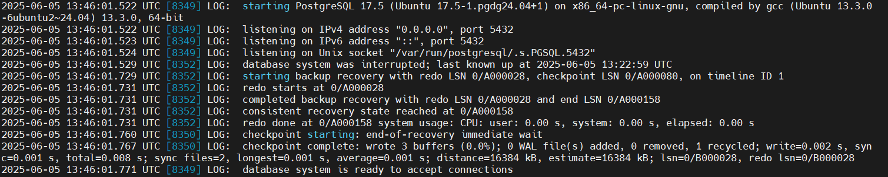

# Домашнее задание "Бэкапы"

### Цель: настроить надёжное резервное копирование и восстановление базы данных

Повторите шаги Алексея:

1. Настройте бэкапы PostgreSQL с использованием WAL-G, pg_probackup или любого другого аналогичного ПО для базы данных "Лояльность оптовиков".

2. Восстановите данные на другом кластере, чтобы убедиться, что бэкапы работают.

3. Проверьте, что данные восстановлены корректно.

4. Дополнительно: Снимите бэкап под нагрузкой с реплики.

реплика почти не отстает

