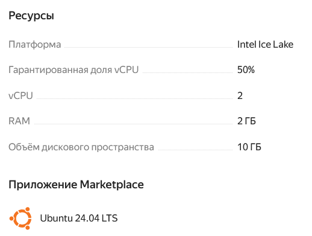
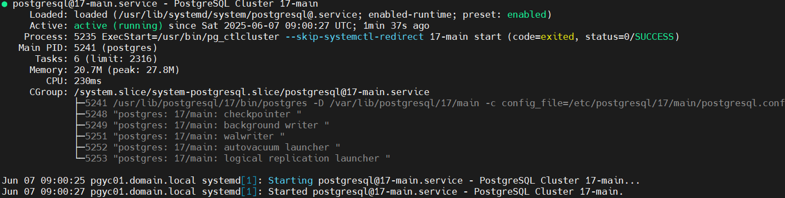
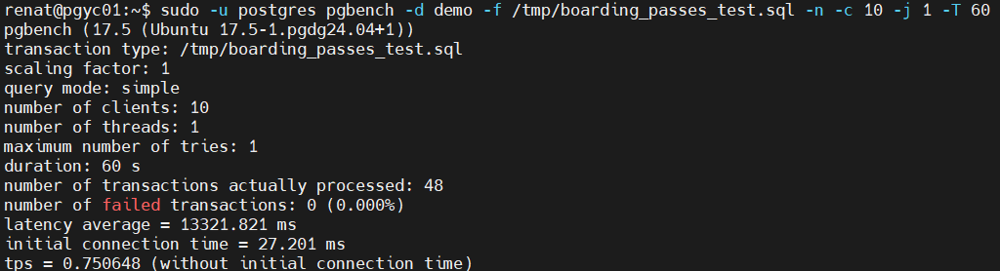
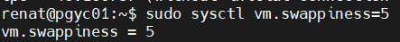
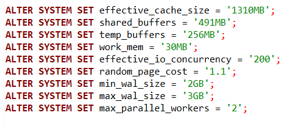
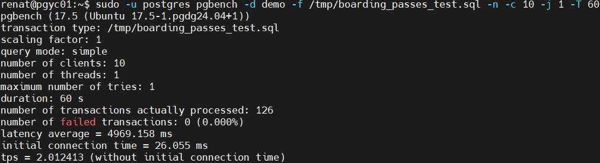
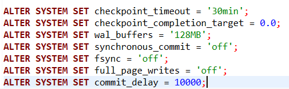
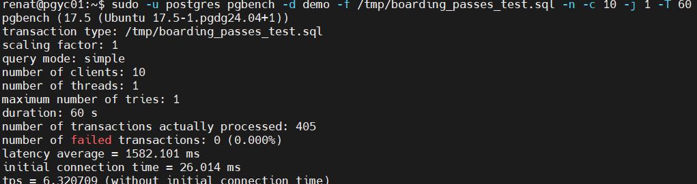

# Домашнее задание "Тюнинг Постгреса"

### Цель: Развернуть инстанс Постгреса в ВМ в ЯО. Оптимизировать настройки

##### Описание/Пошаговая инструкция выполнения домашнего задания:

1. Развернуть Постгрес на ВМ

2. Протестировать pg_bench

взял бд с https://postgrespro.ru/education/demodb
и вначале прогнал скрипт на сервере с настройками по умолчанию boarding_passes_test.sql

`SELECT min(ticket_no), max(ticket_no)
FROM (
  SELECT *
  FROM bookings.boarding_passes
  WHERE flight_id > 1000
  LIMIT 10000
) AS limited_passes
GROUP BY seat_no
ORDER BY seat_no;

SELECT min(ticket_no), max(ticket_no)
FROM (
  SELECT *
  FROM bookings.boarding_passes
  WHERE flight_id > 100000
  LIMIT 10000
) AS limited_passes
GROUP BY seat_no
ORDER BY seat_no;

SELECT min(ticket_no), max(ticket_no)
FROM (
  SELECT *
  FROM bookings.boarding_passes
  WHERE flight_id > 200000
  LIMIT 10000
) AS limited_passes
GROUP BY seat_no
ORDER BY seat_no;

BEGIN;
WITH rows_to_update AS (
    SELECT ctid
    FROM bookings.boarding_passes
    WHERE flight_id BETWEEN 0 AND 5000
    LIMIT 1000
)
UPDATE bookings.boarding_passes bp
SET seat_no = seat_no
FROM rows_to_update r
WHERE bp.ctid = r.ctid;
COMMIT;

BEGIN;
WITH rows_to_update AS (
    SELECT ctid
    FROM bookings.boarding_passes
    WHERE flight_id BETWEEN 70000 AND 80000
    LIMIT 1000
)
UPDATE bookings.boarding_passes bp
SET seat_no = seat_no
FROM rows_to_update r
WHERE bp.ctid = r.ctid;
COMMIT;

BEGIN;
WITH rows_to_update AS (
    SELECT ctid
    FROM bookings.boarding_passes
    WHERE flight_id BETWEEN 130000 AND 180000
    LIMIT 1000
)
UPDATE bookings.boarding_passes bp
SET seat_no = seat_no
FROM rows_to_update r
WHERE bp.ctid = r.ctid;
COMMIT;`

3. Выставить оптимальные настройки

4. Проверить насколько выросла производительность

5. Настроить кластер на оптимальную производительность не обращая внимания на стабильность БД

