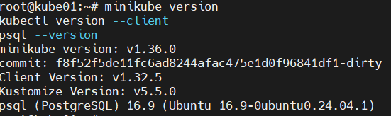
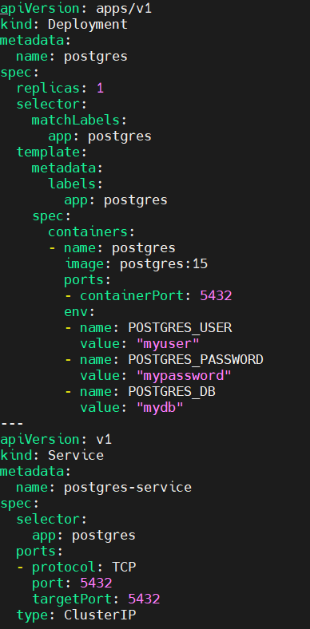
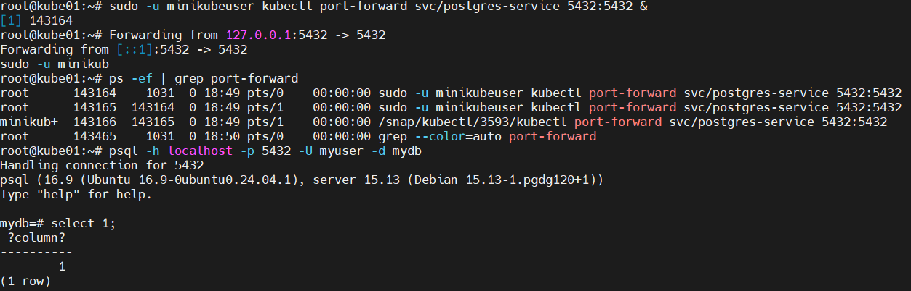
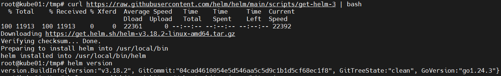
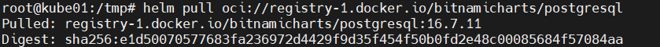
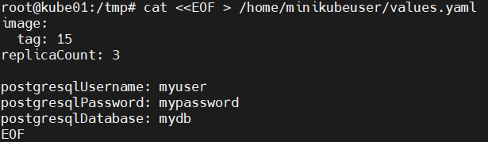
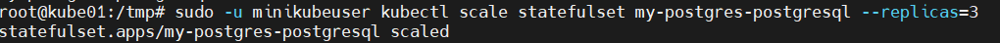
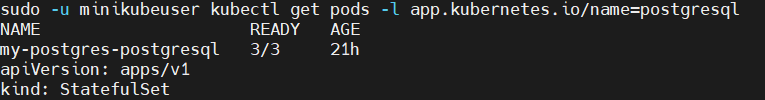
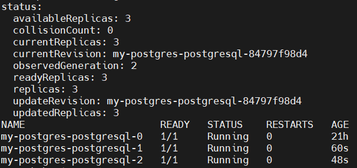

# Домашнее задание "PostgreSQL в Minikube"

### Цель: развернуть PostgreSQL в локальном Kubernetes-кластере Minikube, обеспечить её доступность и масштабируемость

##### Описание/Пошаговая инструкция выполнения домашнего задания:

Описание/Пошаговая инструкция выполнения домашнего задания:

10 января, 08:00
Штаб-квартира BananaFlow

Алексей потягивал кофе, когда в чате разработчиков всплыло тревожное сообщение:

[Австралийский филиал]

"Ребята, у нас кризис! Из-за циклона «Илона» все рейсы задержаны. Клиенты в панике — 300 тонн бананов могут испортиться в порту. Логистическая БД падает под нагрузкой!"

Олег (технический директор) тут же созвал экстренное совещание:

— "Нам нужно перераспределить поставки через другие порты. Но текущая БД не выдерживает одновременных запросов от 12 филиалов!"

Алексей предложил:

— "Давайте срочно развернём PostgreSQL в Minikube и протестируем её под нагрузкой, прежде чем выкатывать в прод!"

🚧 **Подготовка**

Установите и запустите Minikube.
Убедитесь, что у вас установлены kubectl и psql.

🔨 **Основная часть**

Шаг 1: Развернуть PostgreSQL через манифест

Создайте Deployment и Service для PostgreSQL.

Укажите имя пользователя и пароль через переменные окружения в Deployment (например, POSTGRES_USER и POSTGRES_PASSWORD).

Убедитесь, что база данных поднимается и отвечает на подключения (kubectl port-forward + psql).

⭐ **Задание повышенной сложности**

Шаг 2: Развернуть PostgreSQL через Helm

Установите Helm.

Найдите и установите подходящий Helm-чарт PostgreSQL 14 (например, Bitnami PostgreSQL).

Укажите параметры подключения в values.yaml.

Обеспечьте масштабируемость: задайте replicaCount: 3 или используйте StatefulSet, если уверены.

🔥 **Кризисный момент**

12:30 — Новое сообщение из Австралии:

_"Циклон усиливается! Нужно перебросить запасы в Сидней до 15:00!"_

Алексей: _"Масштабируемся!"_

* Увеличьте количество подов до 3

* Убедитесь, что все поды находятся в статусе Running

**📎 Что сдавать**

📷 Скриншот результата SELECT-запроса из PostgreSQL

📷 Скриншот вывода kubectl get pods
(Показывать пароль не нужно!)

💡 **Эпилог**

16:00, тот же день

В чате появляется фото: грузовики с бананами благополучно прибыли в Сидней.

Олег (глядя на Алексея):

_— "Хорошая работа. Но... — достаёт список из 5 новых задач — теперь нужно настроить мониторинг для таких случаев."_

Критерии оценки:

База данных успешно развернута в Minikube
БД принимает подключения и выполняет простой SELECT-запрос
В kubectl get pods отображаются 3 работающих пода

