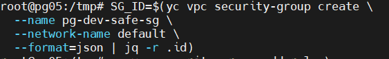
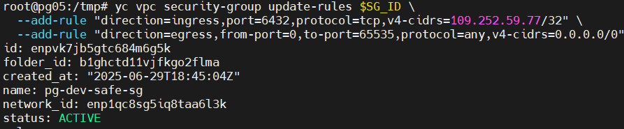
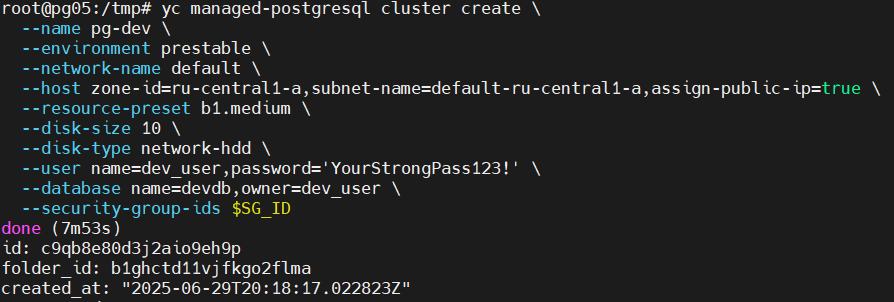
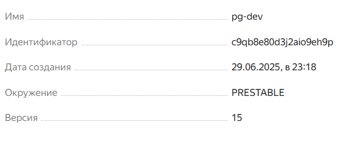
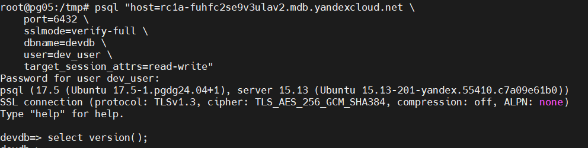
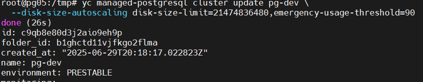
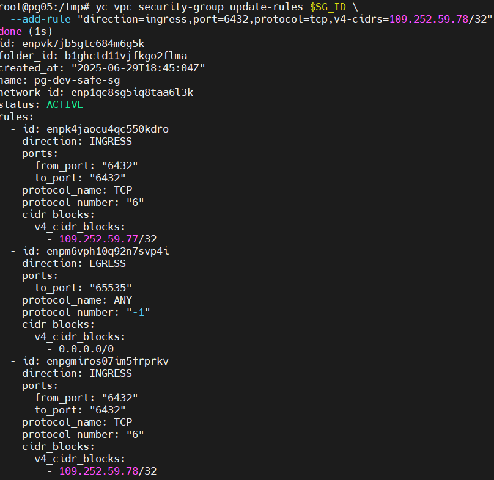

# Домашнее задание "Managed Service for PostgreSQL"

### Цель: получить базовые навыки подключения и работы с базой данных через клиентское приложение

##### Описание/Пошаговая инструкция выполнения домашнего задания:

**Задание: Развернуть Managed PostgreSQL в Yandex Cloud**

1. Создать кластер
   Ресурсы: 1 vCPU, 1 ГБ RAM
   Разрешить доступ с вашего IP

   
3. Подключиться через psql
   Проверить работоспособность кластера

   

   
5. Задокументировать шаги

* Параметры кластера
* Команда подключения
* Пример выполненного запроса
  
  
  **Формат сдачи:**
* Репозиторий на GitHub с README_.md

**Задание со звездочкой**

★ Автомасштабирование: Настроить auto-scaling для обработки пиковых нагрузок\

★ Коллективный доступ: Добавить IP коллеги в белый список

