# Домашнее задание "PostgreSQL и VKcloud, ЯО, Sbercloud"

### Цель: научиться пользоваться PostgreSQL based и like сервисами в VKcloud, ЯО, Sbercloud

##### Описание/Пошаговая инструкция выполнения домашнего задания:
**Задача:**

* Развернуть managed PostgreSQL в двух облаках (на выбор: VK Cloud, Yandex Cloud, SberCloud).
* Минимальные параметры: 1 vCPU, 1 ГБ RAM
* Настроить доступ с вашего IP
* Проверить подключение через psql
* Сравнить характеристики:
* Стоимость в месяц (включая резервные копии)
* Latency при выполнении запросов
* Удобство управления (интерфейс, документация)
* Документировать процесс:
  
  Какие облака выбрали и почему

#### Ориентируюсь на популярность сервисов, вначале выбрал# Managed PostgreSQL®
 

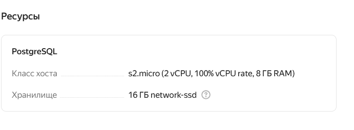

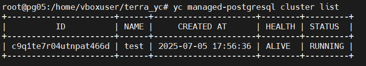

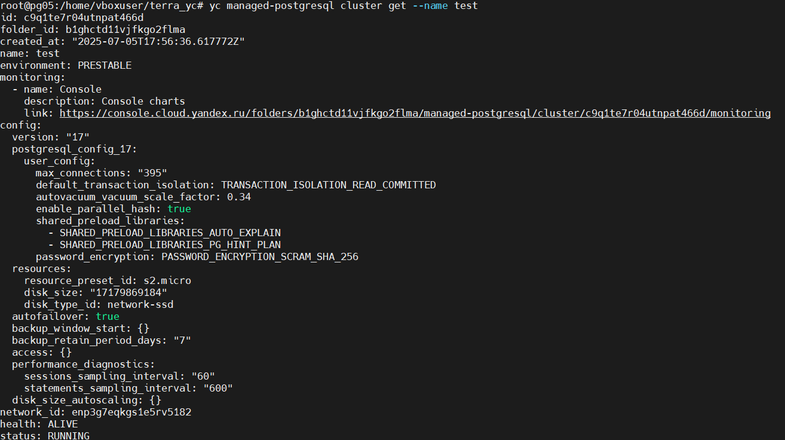

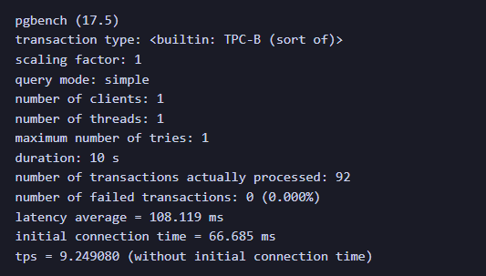

#### Настроил с "Managed PostgreSQL® c cloud.ru"

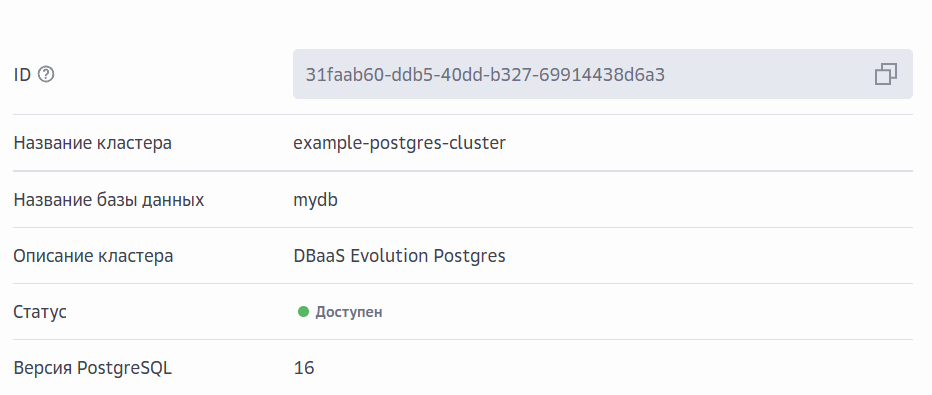

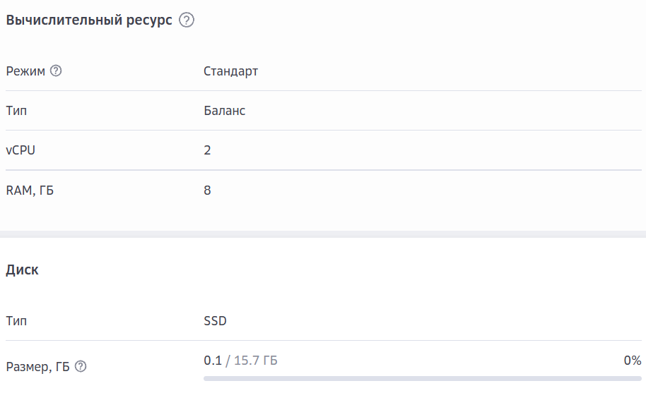

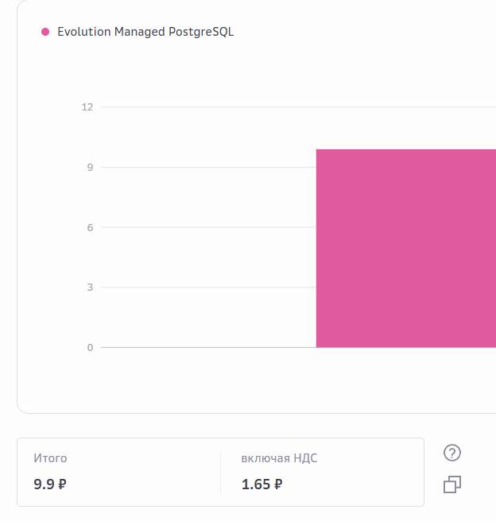
За месяц ~4500 руб без public ip

#### Затем выбрал "VK Cloud" кое как смог настроить двухфакторную аутентификацию

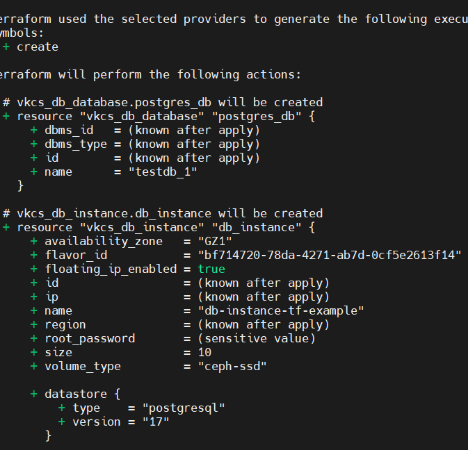

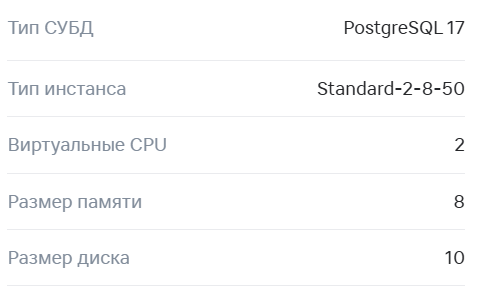

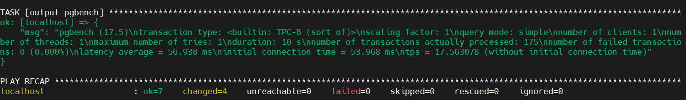

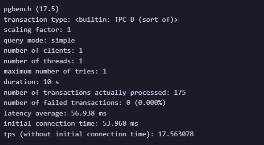

#### Сравнение сервисов 
С какими проблемами столкнулись (например, сложность настройки доступа)

**Yandex Managed Service for PostgreSQL** - к плюсам можно отнести удобный CLI, стоимость за месяц видно сразу в явном виде, но стоимость довольно высокая

**PostgreSQL as a Service VK Cloud** - не просто настроить двухфакторную аутентификацию, зеркало тераформ не смог настроить, рабочие примеры, дают грант даже без привязки карты, по деньгам на мой взгляд дешевле всего, результаты pg_bench лучше чем у Яндекс, да и сам кластер создался в 2 раза быстрее 

**Managed PostgreSQL® cloud.ru** - не смог получить токен, получить бесплатный грант можно только заплатив деньги, не нашел в явном виде сумму затрат за месяц,  по сравнению с яндекс если считать за прошедшее время получилось дешевле, пока доступна 16 версия, к сожелению public ip для postgresql настроить нельзя, а настроить доступ с локальной виртуалки по внутренней подсети не получилось.  

 
* Вывод: какое облако лучше подходит для BananaFlow?

   Порекомендовал посмотреть вначале в сторону VK Cloud если нужно сэкономить, если нужно меньше проблем и не нужно экономить то Яндекс

★ **Задание со звездочкой:**

* Автоматизировать развертывание с помощью Terraform & Ansible:
* Terraform для создания кластеров
* Ansible для настройки подключения и тестовых запросов

