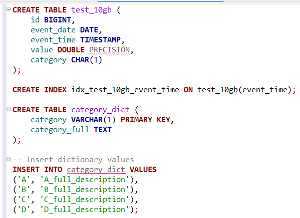
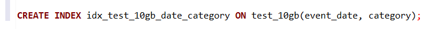
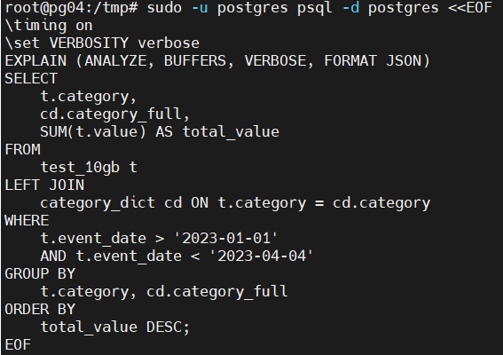

# Домашнее задание "Хранилище, которое выстояло"

### Цель: погрузиться в работу с большими объёмами данных, опробовать механизмы их загрузки и сравнить производительность разных СУБД;

##### Описание/Пошаговая инструкция выполнения домашнего задания:

Для сравнения с PostgreSQL выбрал ClickHouse, для тестирования загружал данные объемом эквивалентным 10 гигабайтам CSV:

###### Загрузка в ClickHouse (2 минуты)

Теперь перейдем к PostgreSQL

###### Вариант загрузки с COPY (11 минут 15 секунд)

###### Вариант загрузки с pg_bulkload (6 минут 51 секунд)

Добавил индекс для запроса:

Как видно из результатов запросов скорость запросов значительно отличается не в пользу PostgreSQL,
ClickHouse намного лучше работает с загрузкой данных в первую очередь за счет остустуствия лога транзакции

Для теста создал материализованную вьюшку в PostgreSQL

Даже с учетом материализованной вьюшки число чтений отличается на порядок, ClickHouse очень выигрывает за счет использования колоночного способа хранения данных и сжатия данных

##Вывод: 
очень сильно отличающиеся системы, с разными целями и свойствами. Понравилась простота использования, удобство и продуманность архитектуры ClickHouse, большая скорость OLAP запросов. Всвою очередь на стороне PostgreSQL поддержка транзакций и полная поддержка ACID, большая скорость OLTP и более продвинутый оптимизатор запросов.

