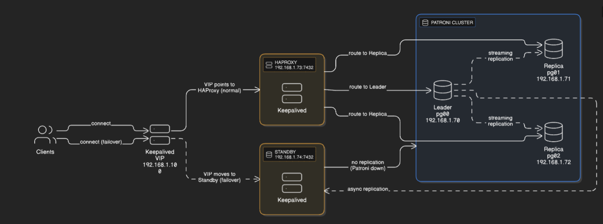
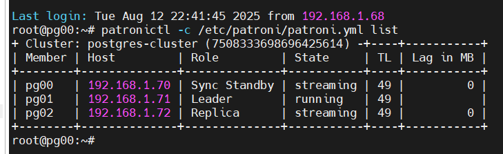
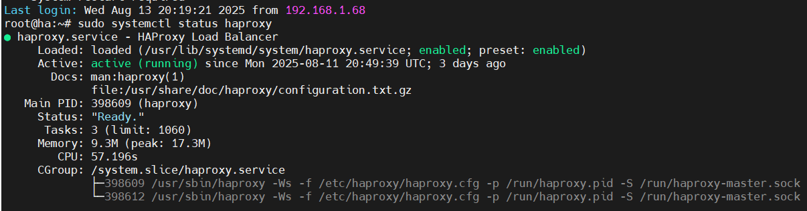
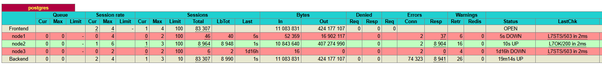
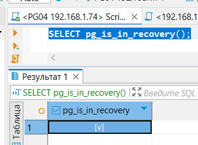
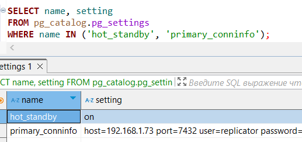
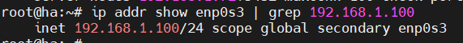
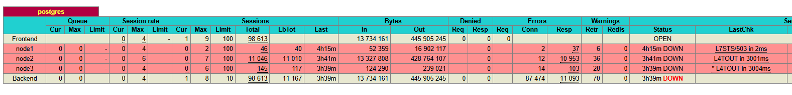
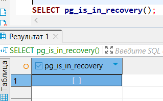

# Домашнее задание "Кластеры высокой доступности"

### Цель: научиться развертывать кластер PostgreSQL с высокой доступностью в облаке или локальной среде, используя подходящие инструменты и технологии;

##### Описание/Пошаговая инструкция выполнения домашнего задания:

🔧 **Вариант 1. Кластер своими руками**

Разверните высокодоступный кластер PostgreSQL вручную. Возможные технологии:

* Patroni + Etcd + HAProxy
* Pacemaker/Corosync/DRBD (для продвинутых)

Среда развертывания:

Можно использовать виртуальные машины в локальной сети (например, через VirtualBox, Proxmox)

Три сервера объединенны в кластер Patroni

Первоначально Keepalived указывает на HAProxy:

Симитируем отказ кластера patroni:

StandBy сервер переходит в режим master

и VIP переходит на StandBy сервер

