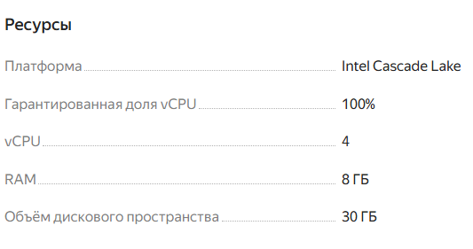
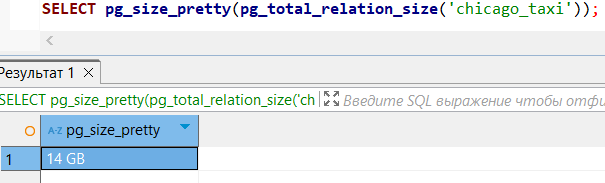
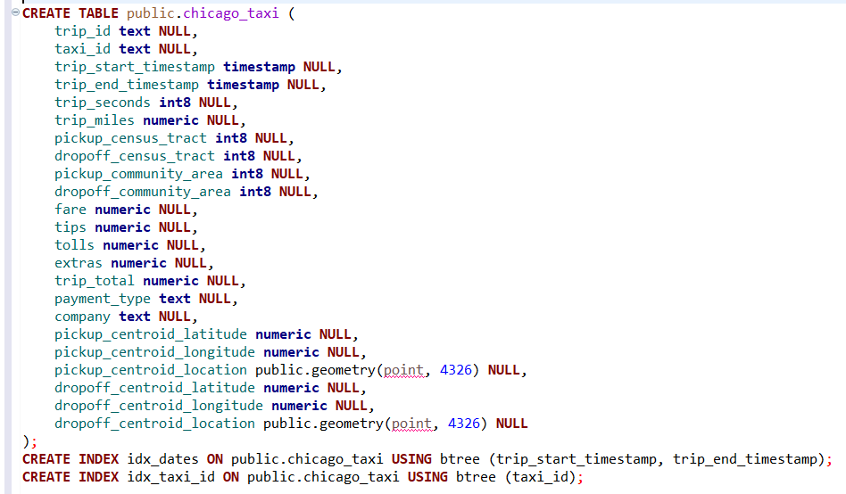
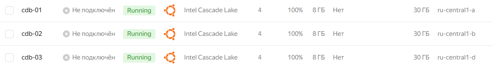
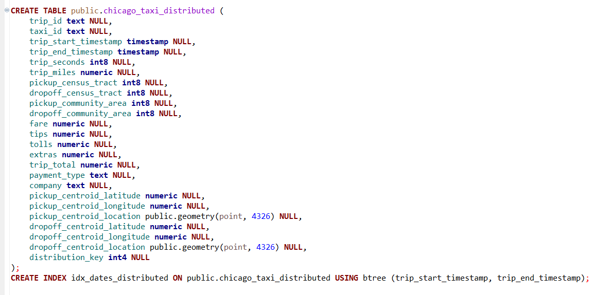
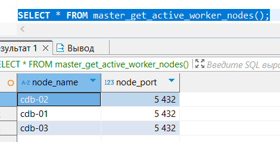
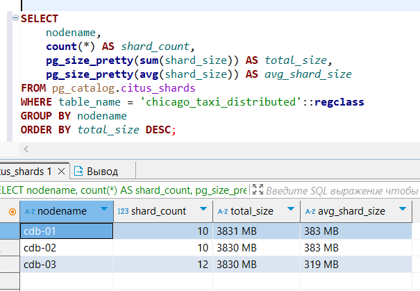
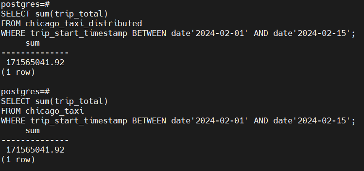
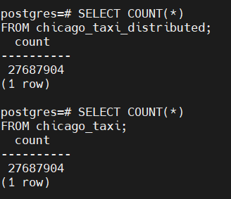
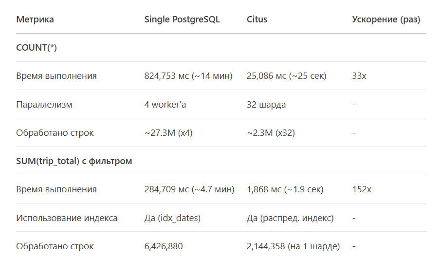

# Домашнее задание "Мульти-мастер кластер"

### Цель: освоить развёртывание и тестирование геораспределённых мульти-мастер баз данных;

#### 🛠 **Вариант 2: Геораспределённый PostgreSQL-like сервис**

* Перенеси 10 Гб тестовой БД в геораспределённый кластер PostgreSQL или совместимый сервис
* Настрой синхронизацию и балансировку нагрузки между регионами
* Проверь отклик и консистентность данных
* Опиши весь процесс и проблемы

#### **🗂 Формат сдачи**

* Репозиторий с инструкциями, скриптами и конфигурациями (если есть).
* Скриншоты, логи или видео с тестированием отказоустойчивости и производительности.
* Краткий отчёт с выводами и рекомендациями.

#### Критерии оценки:

* Развёрнут мульти-мастер кластер в доступной среде (российское облако или локально).
* Проведено тестирование с данными объёмом не менее 10 ГБ.
* Представлен отчёт с описанием развертывания, проблем и результатов тестов.

##### Тестирование на одном сервере

Использовал размноженную базу taxi-trips-chicago-2024

`EXPLAIN ANALYZE SELECT count(*) FROM chicago_taxi;`

<!--  Finalize Aggregate  (cost=1893221.12..1893221.13 rows=1 width=8) (actual time=824620.153..824660.083 rows=1 loops=1)
   ->  Gather  (cost=1893220.70..1893221.11 rows=4 width=8) (actual time=824593.306..824660.033 rows=4 loops=1)
         Workers Planned: 4
         Workers Launched: 3
         ->  Partial Aggregate  (cost=1892220.70..1892220.71 rows=1 width=8) (actual time=824576.913..824576.914 rows=1 loops=4)
               ->  Parallel Seq Scan on chicago_taxi  (cost=0.00..1874915.76 rows=6921976 width=0) (actual time=4.083..824138.911 rows=6921976 loops=4)
 Planning Time: 0.591 ms
 JIT:
   Functions: 10
   Options: Inlining true, Optimization true, Expressions true, Deforming true
   Timing: Generation 0.989 ms (Deform 0.000 ms), Inlining 433.220 ms, Optimization 36.102 ms, Emission 35.382 ms, Total 505.693 ms
 Execution Time: 824752.896 ms
(12 rows) -->

`EXPLAIN ANALYZE select sum(trip_total) from chicago_taxi where trip_start_timestamp between date'2024-02-01' and date'2024-02-15';`

<!--  Aggregate  (cost=156738.61..156738.62 rows=1 width=32) (actual time=284706.701..284706.704 rows=1 loops=1)
   ->  Bitmap Heap Scan on chicago_taxi  (cost=1567.05..156392.51 rows=138440 width=32) (actual time=361.915..283222.139 rows=6426880 loops=1)
         Recheck Cond: ((trip_start_timestamp >= '2024-02-01'::date) AND (trip_start_timestamp <= '2024-02-15'::date))
         Heap Blocks: exact=343965
         ->  Bitmap Index Scan on idx_dates  (cost=0.00..1532.44 rows=138440 width=0) (actual time=266.778..266.778 rows=6426880 loops=1)
               Index Cond: ((trip_start_timestamp >= '2024-02-01'::date) AND (trip_start_timestamp <= '2024-02-15'::date))
 Planning Time: 0.091 ms
 JIT:
   Functions: 5
   Options: Inlining false, Optimization false, Expressions true, Deforming true
   Timing: Generation 0.487 ms (Deform 0.272 ms), Inlining 0.000 ms, Optimization 0.423 ms, Emission 5.026 ms, Total 5.936 ms
 Execution Time: 284708.777 ms
(12 rows) -->

##### Тестирование с расширенимем Citus

`EXPLAIN ANALYZE SELECT count(*) FROM chicago_taxi_distributed;`

<!--  QUERY PLAN                                               
--------------------------------------------------------------------------------------------------------------------------------------------------------------------------------------------------------------------
 Aggregate  (cost=250.00..250.02 rows=1 width=8) (actual time=25085.749..25085.750 rows=1 loops=1)
   ->  Custom Scan (Citus Adaptive)  (cost=0.00..0.00 rows=100000 width=8) (actual time=25085.727..25085.733 rows=32 loops=1)
         Task Count: 32
         Tuple data received from nodes: 256 bytes
         Tasks Shown: One of 32
         ->  Task
               Tuple data received from node: 8 bytes
               Node: host=cdb-03 port=5432 dbname=postgres
               ->  Finalize Aggregate  (cost=256289.83..256289.85 rows=1 width=8) (actual time=21497.621..21505.333 rows=1 loops=1)
                     ->  Gather  (cost=256289.41..256289.82 rows=4 width=8) (actual time=21497.443..21505.319 rows=2 loops=1)
                           Workers Planned: 4
                           Workers Launched: 1
                           ->  Partial Aggregate  (cost=255289.41..255289.42 rows=1 width=8) (actual time=21483.970..21483.971 rows=1 loops=2)
                                 ->  Parallel Seq Scan on chicago_taxi_distributed_102085 chicago_taxi_distributed  (cost=0.00..252406.33 rows=1153233 width=0) (actual time=8.621..20780.710 rows=2306466 loops=2)
                   Planning Time: 0.562 ms
                   JIT:
                     Functions: 6
                     Options: Inlining false, Optimization false, Expressions true, Deforming true
                     Timing: Generation 5.470 ms (Deform 0.000 ms), Inlining 0.000 ms, Optimization 15.373 ms, Emission 1195.597 ms, Total 1216.440 ms
                   Execution Time: 25035.730 ms
 Planning Time: 0.995 ms
 Execution Time: 25085.827 ms
(22 rows)
 -->

`
EXPLAIN ANALYZE SELECT sum(trip_total)
FROM chicago_taxi_distributed
WHERE trip_start_timestamp BETWEEN date'2024-02-01' AND date'2024-02-15';;`

<!--   Aggregate  (cost=250.00..250.01 rows=1 width=32) (actual time=1868.450..1868.452 rows=1 loops=1)
   ->  Custom Scan (Citus Adaptive)  (cost=0.00..0.00 rows=100000 width=32) (actual time=1867.338..1867.344 rows=32 loops=1)
         Task Count: 32
         Tuple data received from nodes: 56 bytes
         Tasks Shown: One of 32
         ->  Task
               Tuple data received from node: 14 bytes
               Node: host=cdb-01 port=5432 dbname=postgres
               ->  Aggregate  (cost=51520.18..51520.19 rows=1 width=32) (actual time=1849.020..1849.022 rows=1 loops=1)
                     ->  Bitmap Heap Scan on chicago_taxi_distributed_102096 chicago_taxi_distributed  (cost=523.89..51404.79 rows=46152 width=32) (actual time=141.128..1410.378 rows=2144358 loops=1)
                           Recheck Cond: ((trip_start_timestamp >= '2024-02-01'::date) AND (trip_start_timestamp <= '2024-02-15'::date))
                           Heap Blocks: exact=112382
                           ->  Bitmap Index Scan on idx_dates_distributed_102096  (cost=0.00..512.36 rows=46152 width=0) (actual time=111.472..111.473 rows=2144358 loops=1)
                                 Index Cond: ((trip_start_timestamp >= '2024-02-01'::date) AND (trip_start_timestamp <= '2024-02-15'::date))
                   Planning Time: 0.114 ms
                   Execution Time: 1849.819 ms
 Planning Time: 0.761 ms
 Execution Time: 1868.481 ms
(18 rows)
 -->

Несмотря на странные планы запросы выполнляются правильно и горадо быстрее чем на одной ноде

