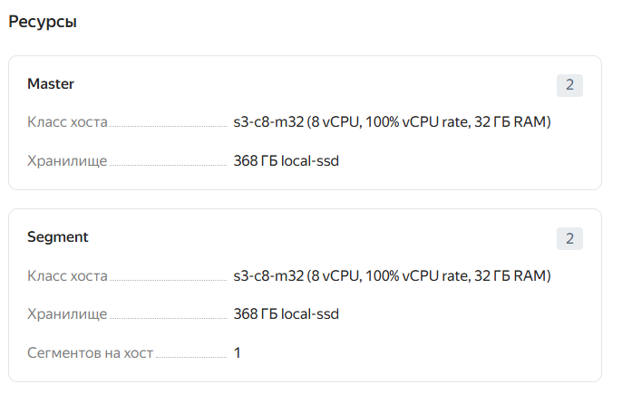
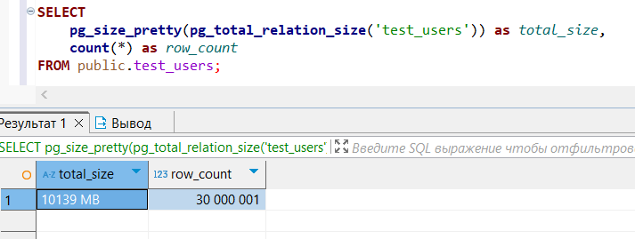
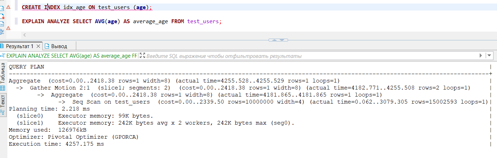
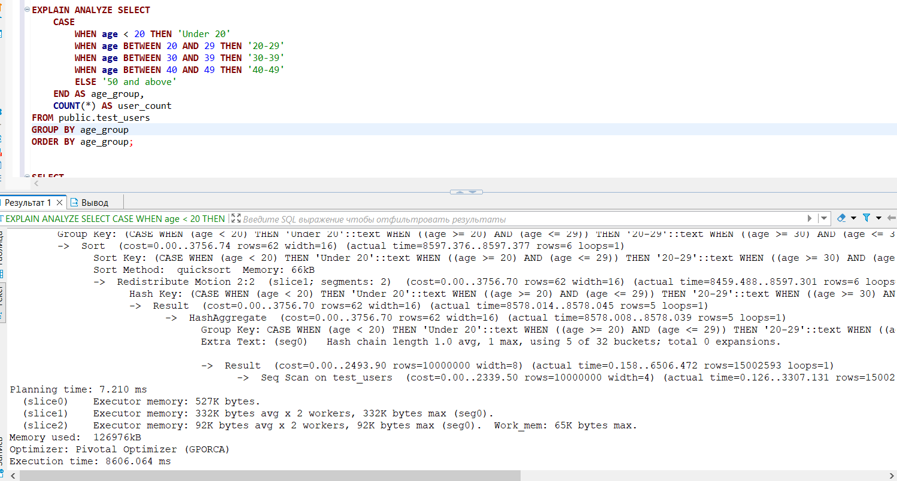
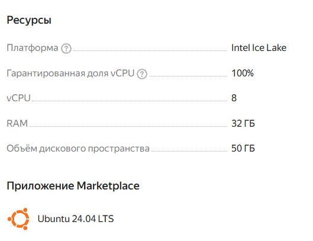
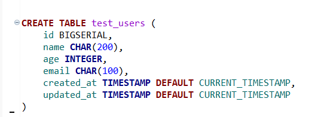
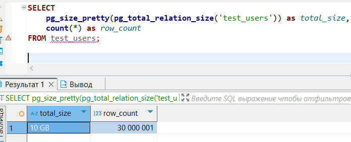
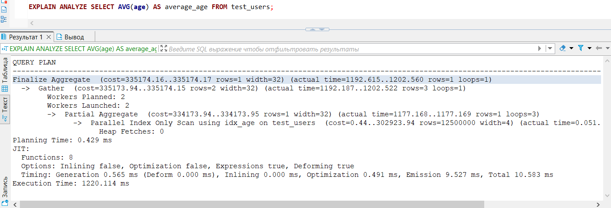
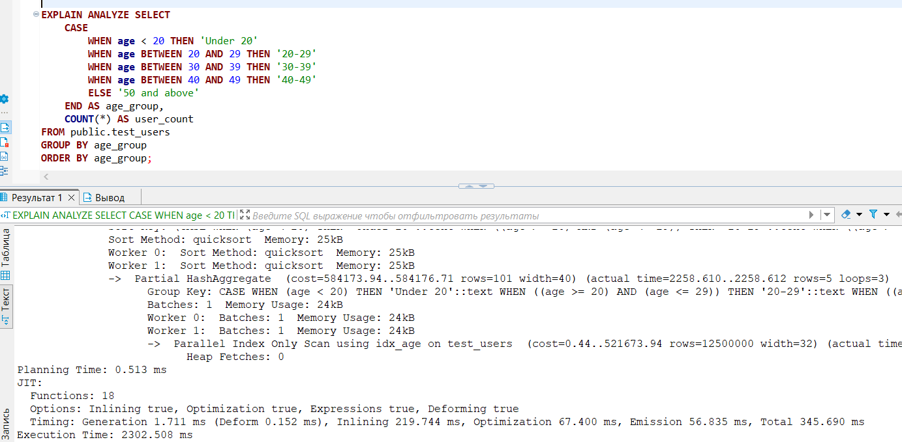

# Домашнее задание "Параллельный кластер"

### Цель: отработать навыки развертывания и тестирования параллельных кластеров;

#### 🎯 **Задание**

* Разверните Yugabyte или Greenplum в Kubernetes или облаках.
* Загрузите датасет 10 Гб+ .
* Проведите тест скорости запросов в сравнении с одиночным инстансом PostgreSQL.
* Опишите процесс развертывания, настройки, проблемы и результаты.

#### 🗂 **Формат сдачи**

* Ссылка на репозиторий с инструкциями, конфигурациями и скриптами.
* Скриншоты, логи или видео тестов производительности.
* Краткий отчёт с выводами и рекомендациями.

#### Критерии оценки:

Развёрнут один из кластеров: Yugabyte или Greenplum в Kubernetes (российские облака или альтернативы).
Загружен датасет объёмом не менее 10 ГБ.
Проведено тестирование скорости запросов и сравнение с одиночным инстансом PostgreSQL.
Предоставлен отчёт с описанием процесса, проблем и результатов.

##### Тестирую с Managed Service for Greenplum Yandex Cloud

##### Тестируем одиночную ноду

#### Выводы

Как видно из планов запросов и времени их выполнения важно выбрать подходящее для запросов распределение таблицы которе влияет на план запроса, тк в итоге оптимизатор выбрал сканирование всей таблицы что сказалось на времени выполнения запроса. Преимущество в памяти тоже не помогло тк таблица помещалась в памяти даже на одиночной ноде. 