# Домашнее задание "Высокая доступность: развертывание Patroni
"

### Цель:
- развернуть отказоустойчивый кластер PostgreSQL с Patroni;

* Создайте 3 виртуальные машины для etcd и 3 виртуальные машины для Patroni.

Так как создаю виртуалки на ноутбуке то в целях экономии развернул etcd на тех серверах что и PostgreSQL:
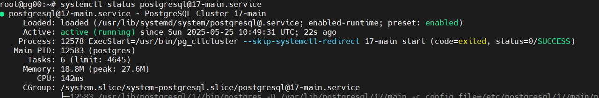

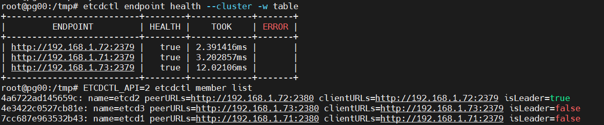

* Разверните HA-кластер PostgreSQL с использованием Patroni.

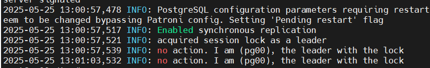

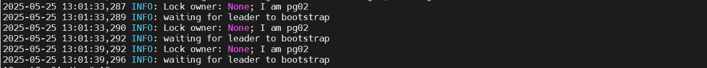

* Настройте HAProxy для балансировки нагрузки.

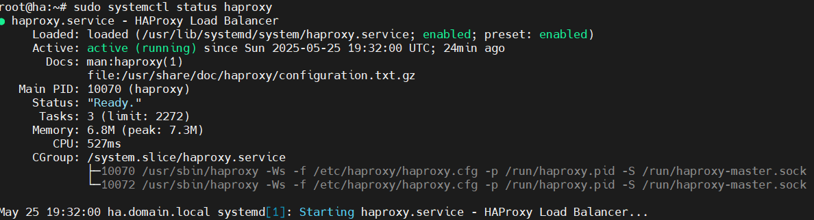

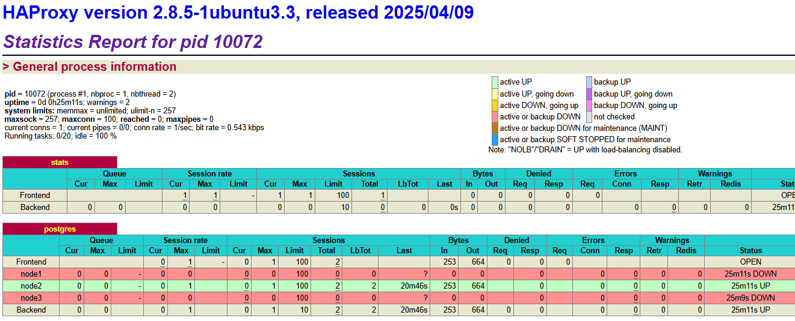

* Проверьте отказоустойчивость кластера, имитируя сбой на одном из узлов.
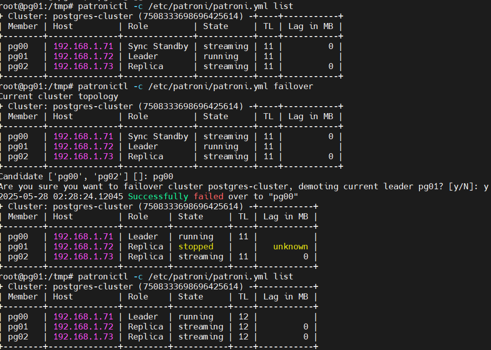

* Дополнительно: Настройте бэкапы с использованием WAL-G или pg_probackup.

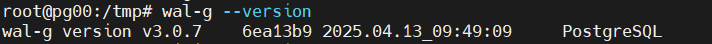

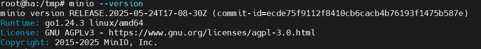

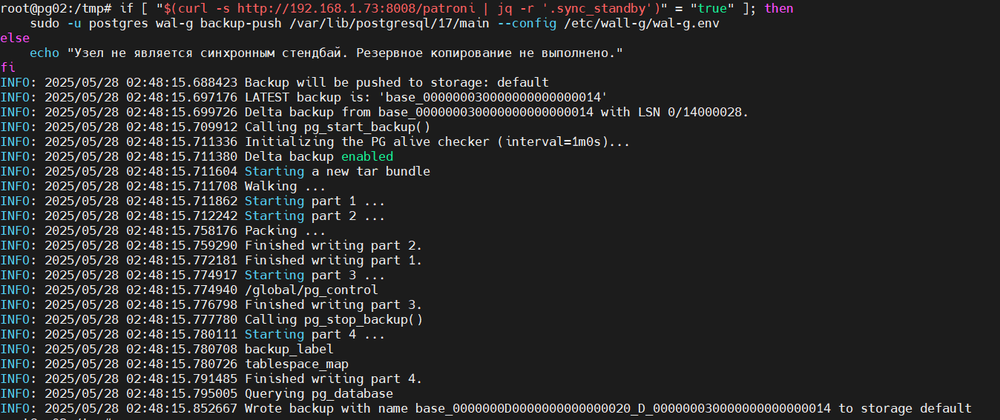

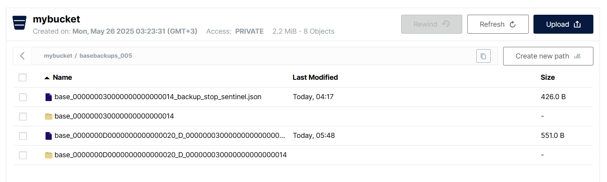

