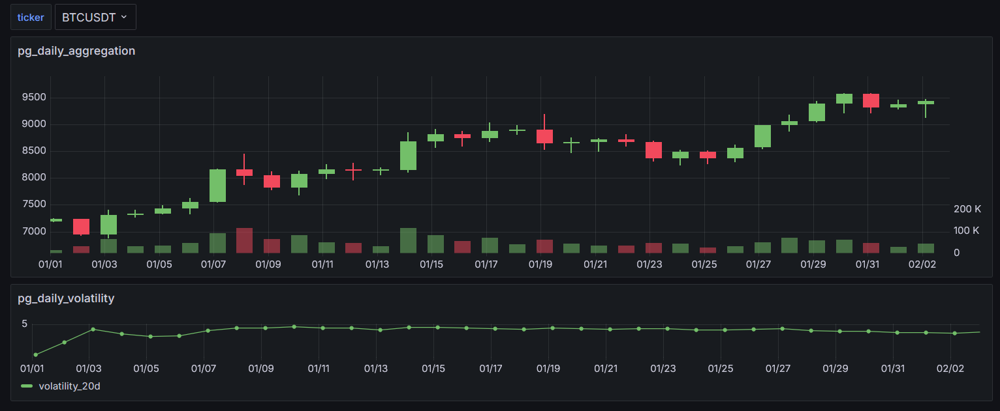
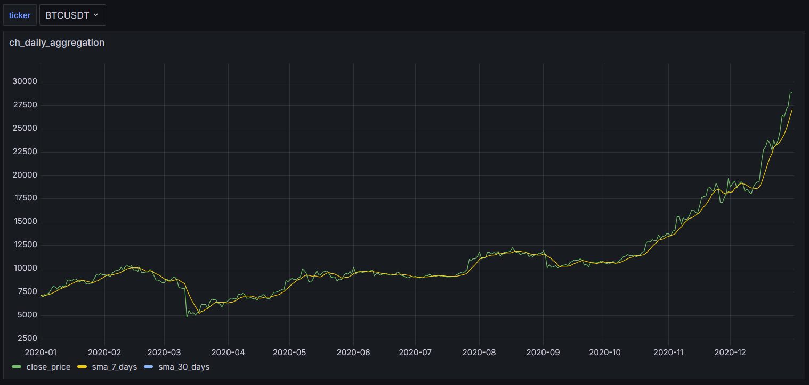
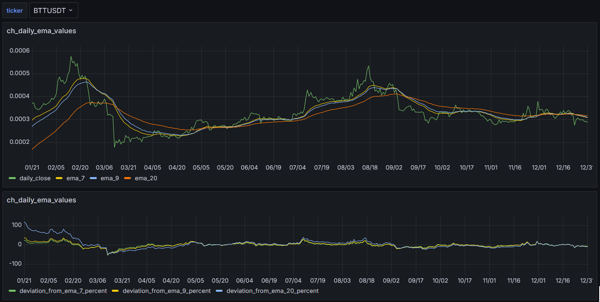

# FinInsight

- отображение данных торгов различных бирж (на примере Binance)
- технический анализ загруженных данных, на примере вычисления SMA (simple moving average) простое скользящее среднее,EMA (exponential moving average) экспоненциальной скользящей средней, и других торговых индикаторов

скрипты разбиты на три группы
- DataLoading
- DataSchema
- Grafana
- patroni
  
## DataLoading
Способы загрузки данных брал с сайта [Binance Data Collection](https://data.binance.vision/) который предоставляет простой публичный доступ к данным торгов агрегированный в файлы по дням и месяцам.

Данные торгов за день доступны на следующий день, месячные данные доступны в первый понедельник месяца.

Файлы `klines` доступны из `/api/v3/klines` API endpoint:

|Open time|Open|High|Low|Close|Volume|Close time|Quote asset volume|Number of trades|Taker buy base asset volume|Taker buy quote asset volume|Ignore|
| -- | -- | -- | -- | -- | -- | -- | -- | -- | -- | -- | -- |
|1735689600000000|4.15070000|4.15870000|4.15060000|4.15540000|539.23000000|1735693199999999|2240.39860900|13|401.82000000|1669.98121300|0|

Доступные интервалы kline intervals: 
- `1s`, `1m`, `3m`, `5m`, `15m`, `30m`, `1h`, `2h`, `4h`, `6h`, `8h`, `12h`, `1d`, `3d`, `1w`, `1mo`.

download-klines.sh - загрузка информации торгов в локальную директорию  
copy_to_oltp_pg.sh - загрузка информации торгов в PostgreSQL OLTP
copy_to_dwh.sh - загрузка информации торгов в PostgreSQL DWH
copy_to_clickhouse.sh - загрузка информации торгов в ClickHouse  

## DataSchema
OLTP.sql - создание схемы данных для хранения информации о торгах  
БД BINANCE
таблица binance_klines хранит данные торгов:
```
CREATE TABLE public.binance_klines (
id serial4 NOT NULL,
ticker varchar(20) NOT NULL,
"interval" varchar(10) NOT NULL,
"year" int4 NOT NULL,
"month" int4 NOT NULL,
open_time int8 NOT NULL,
open_price numeric(20, 8) NOT NULL,
high_price numeric(20, 8) NOT NULL,
low_price numeric(20, 8) NOT NULL,
close_price numeric(20, 8) NOT NULL,
volume numeric(30, 8) NOT NULL,
close_time int8 NOT NULL,
quote_asset_volume numeric(30, 8) NOT NULL,
number_of_trades int4 NOT NULL,
taker_buy_base_asset_volume numeric(30, 8) NOT NULL,
taker_buy_quote_asset_volume numeric(30, 8) NOT NULL,
unused_field varchar(10) NULL,
CONSTRAINT binance_klines_pkey PRIMARY KEY (id),
CONSTRAINT binance_klines_ticker_interval_open_time_key UNIQUE (ticker, "interval", open_time)
);

```

DWH.sql - создание схемы данных для хранения информации о торгах для DWH
БД BINANCE_A
таблица binance_a_klines хранит данные торгов:
```
CREATE TABLE public.binance_a_klines (
	id serial4 NOT NULL,
	ticker varchar(20) NOT NULL,
	"interval" varchar(10) NOT NULL,
	"year" int4 NOT NULL,
	"month" int4 NOT NULL,
	open_time int8 NOT NULL,
	open_price numeric(20, 8) NOT NULL,
	high_price numeric(20, 8) NOT NULL,
	low_price numeric(20, 8) NOT NULL,
	close_price numeric(20, 8) NOT NULL,
	volume numeric(30, 8) NOT NULL,
	close_time int8 NOT NULL,
	quote_asset_volume numeric(30, 8) NOT NULL,
	number_of_trades int4 NOT NULL,
	taker_buy_base_asset_volume numeric(30, 8) NOT NULL,
	taker_buy_quote_asset_volume numeric(30, 8) NOT NULL,
	unused_field varchar(10) NULL,
	CONSTRAINT binance_a_klines_pkey PRIMARY KEY (ticker, "interval", open_time),
	CONSTRAINT binance_a_klines_ticker_interval_open_time_key UNIQUE (ticker, "interval", open_time)
)
PARTITION BY RANGE (open_time);
```

ClickHouse.sql - создание схемы данных для хранения информации о торгах для ClickHouse
БД BINANCE_CH
таблица binance_klines_ch хранит данные торгов:
```
CREATE TABLE binance_ch.binance_klines_ch (
    id UInt64,
    ticker String,
    interval String,
    year UInt16,
    month UInt8,
    open_time Int64,
    open_price Decimal(20, 8),
    high_price Decimal(20, 8),
    low_price Decimal(20, 8),
    close_price Decimal(20, 8),
    volume Decimal(30, 8),
    close_time Int64,
    quote_asset_volume Decimal(30, 8),
    number_of_trades UInt32,
    taker_buy_base_asset_volume Decimal(30, 8),
    taker_buy_quote_asset_volume Decimal(30, 8),
    unused_field String
) ENGINE = ReplacingMergeTree()
PARTITION BY (year, month)
ORDER BY (ticker, interval, open_time) 
SETTINGS index_granularity = 8192;
```
## Grafana
ch_daily_aggregation.json - дашборд для отображения данных из ClickHouse  (sma7, sma30) 
ch_daily_ema_values.json - дашборд для отображения данных из ClickHouse  (ema7, ema9, ema20) 
pg_daily_aggregation.json - дашборд для отображения данных из DWH  (общая статистика, волатильность) 
pg_daily_sma.json - дашборд для отображения данных из DWH  (sma7, sma30) 
pg_volume_analysis.json - дашборд для отображения данных из DWH  (статистика объемов)










